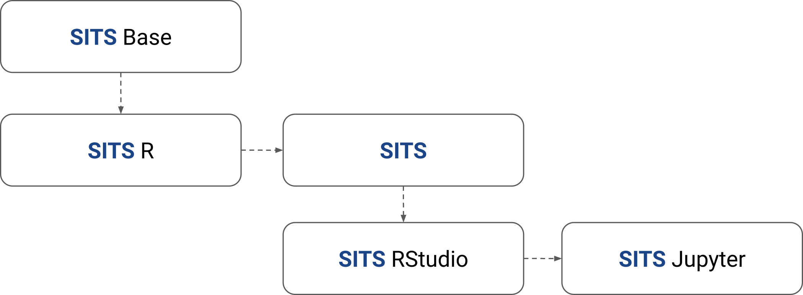
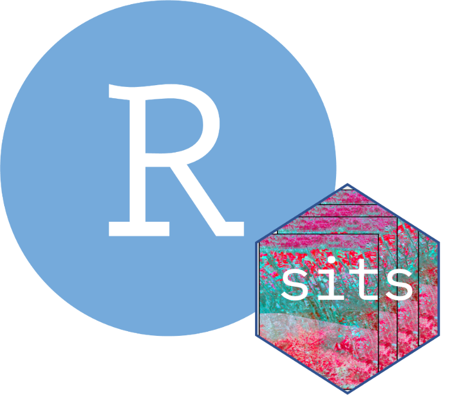

# SITS Docker Images 

[](https://github.com//brazil-data-cube/sits-docker/blob/master/LICENSE) [](https://www.tidyverse.org/lifecycle/#maturing) [](https://github.com/brazil-data-cube/sits-docker/releases) [](https://hub.docker.com/r/brazildatacube/sits) [](https://hub.docker.com/r/brazildatacube/sits) [](https://discord.com/channels/689541907621085198#)

This is the official repository of Docker images for the [SITS R package](https://github.com/e-sensing/sits). In this repository, you can find the recipes to build RStudio-based and Jupyter-based environments to use the SITS package.

## Available images

The `composable images` approach was adopted in this repository to facilitate the construction of SITS-enabled environments that allow the full use of the SITS package features. In this approach, following a hierarchical structure, the installations and configurations are done at different levels. The lower level provides the base capabilities and resources for the higher level images. Because of this, the relationship of these images generates a tree of dependencies, which is presented below.

<br/>
<div align="center">
 
</div>
<br/>
           
In total, five images are available, with the following responsibilities:

- `SITS Base`: Provides the base resources for building an **R** environment to allow the use of the SITS package (e.g., OS libraries for compiling geospatial dependencies, resources for using `LaTeX`, etc);
- `SITS R`: Provides an environment with **R** installed along with all the libraries and dependencies needed to use SITS (e.g., `gdal`, `earth`, `sf`). It does not include the SITS package;
- `SITS`: Provides installation of the SITS package;
- `SITS Rstudio`: RStudio environment with SITS-enabled;
- `SITS Jupyter`: Jupyter Notebook environment with SITS-enabled. It also provides access to an RStudio Server.

If you want to get started, see below for a step-by-step guide to using the `RStudio` and `Jupyter Notebook` images that are ready to use and are available on [DockerHub](https://hub.docker.com/u/brazildatacube). However, you can also build these images on your machine if you prefer. To do this, see the `Building the Docker Image` section.

## Using the SITS R Package with RStudio 

To use the RStudio environment with SITS-enabled, you can run a container from the [brazildatacube/sits-rstudio:0.16.1](https://hub.docker.com/r/brazildatacube/sits-rstudio) image, which is made available on DockerHub. For this, the following command can be used:

```shell
docker run --detach \
           --publish 127.0.0.1:8787:8787 \
           --name my-sits-rstudio \
           brazildatacube/sits-rstudio:0.16.1
```

Then, open the URL `http://127.0.0.1:8787` in a web browser:

```shell
firefox http://127.0.0.1:8787
```

> To login use `sits` as user and password.

## Using the SITS R Package with Jupyter Notebook 

> In this image, its available the Jupyter Notebook environment together with RStudio.

To use the Jupyter Notebook environment with SITS-enabled, you can run a container from the [brazildatacube/sits-jupyter:0.16.1](https://hub.docker.com/r/brazildatacube/sits-jupyter) image, which is made available on DockerHub. For this, the following command can be used:

```shell
docker run --detach \
           --publish 127.0.0.1:8888:8888 \
           --name my-sits-jupyter \
           brazildatacube/sits-jupyter:0.16.1
```

After running the above command, it is necessary to recover the Jupyter access token. To do this, use the command below:

```shell
docker exec -it my-sits-jupyter jupyter lab list
```

The Jupyter server should respond with a message that looks like this:

```
Currently running servers:
http://cea9535dd267:8888/?token=d8817e283ad216ef1d920bb5cdd125a1cd104c4374df20bf :: /home/sits
```

Use the access token shown on your server output to access the Jupyter environment in your browser at the local address of the host machine. Example:

```shell
firefox http://127.0.0.1:8888/?token=d8817e283ad216ef1d920bb5cdd125a1cd104c4374df20bf
```

## Building the Docker Images

To build the images with the Dockerfiles contained in this repository, it is possible to use the `build.sh` utility script. This script presents options for the customization of the images generated for the use of the SITS package. The script has the following options that can be used to customize the generated images:

- `-n`: Build with `--no-cache` flag (Default uses pre-built image cache).  
- `-t`: SITS Tag version used in generated image (Default is `0.9.8`).
- `-p`: Image name prefix (Default is `bdc`).
- `-e`: SITS environment type (`full` or `minimal`. Default is `full`).
- `-h`: show a help message.

Below is an example of using the utility script. The tag name defined for the SITS image is `0.16.0`.

```shell
./build.sh -n -p brazildatacube -t 0.16.0
```

The above command will create the following images:

```shell
docker image ls | grep sits
```

```
brazildatacube/sits-base      0.16.0     d3a624950f4c   8 hours ago         2.92GB
brazildatacube/sits-r         0.16.0     c5f7e06b7655   6 hours ago         4.36GB
brazildatacube/sits           0.16.0     577704cad80a   6 hours ago         4.54GB
brazildatacube/sits-jupyter   0.16.0     3d3dc8157968   6 hours ago         5.72GB
brazildatacube/sits-rstudio   0.16.0     45f0399e4ec8   6 hours ago         5.47GB
```
